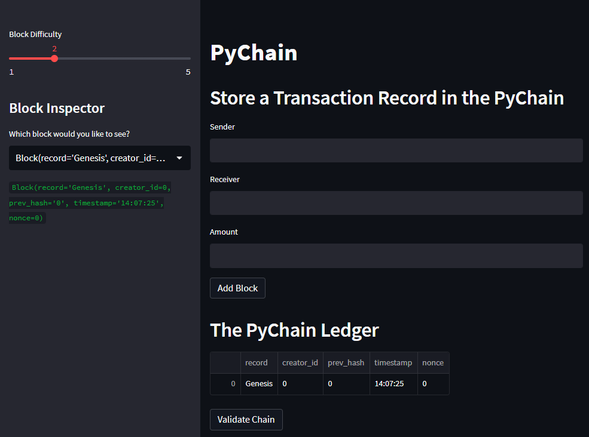
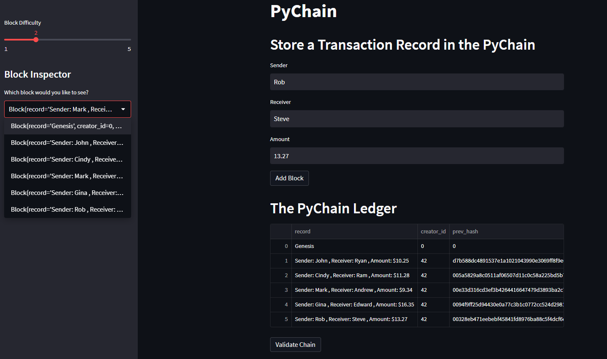
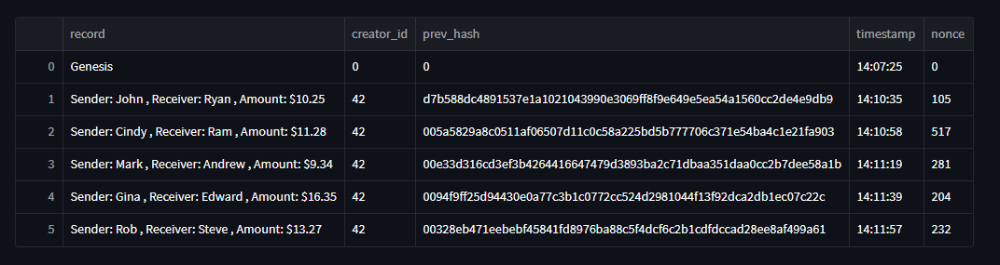
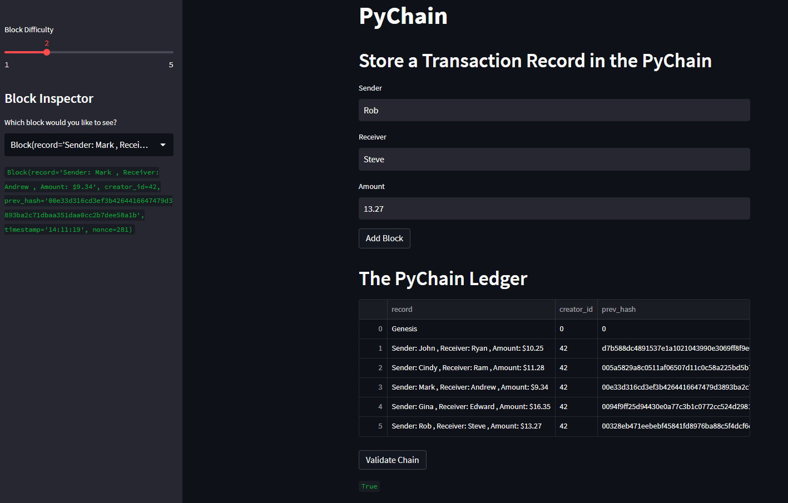
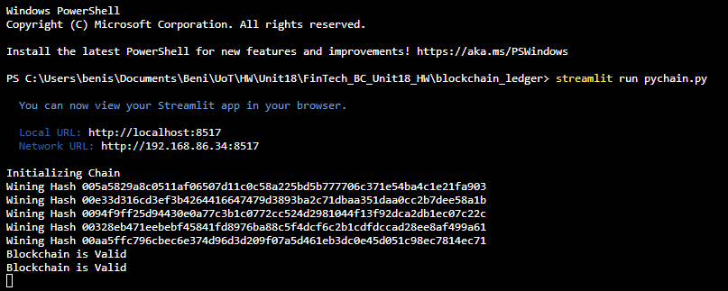

# blockchain_ledger

# PyChain
This is a blockchain-based ledger system allowing partner banks to conduct financial transactions between senders and receivers and to verify the integrity of the data in the ledger.

 

# Steamlit application
PyChain ledger and user interface by running the Streamlit application and storing some mined blocks in the PyChain ledger. Then the blockchain validation process is performed by using the PyChain ledger

 

## Step1:
Initializing the Streamlit applicatiion

 

## Step2:

Enter values for the sender, receiver, and amount, and then click the Add Block button.

 
Block contents and hashes in the Streamlit dropdown menu

 

Ledger

 

## Step3:
Test the blockchain validation process

 

Validity of the blockchain

 

## Output

Interactive view from the terminal for the various steps executed in the Streamlit application to conduct financial trasactions to transfer money between senders and received and verify the integrity of the data in the ledger.

